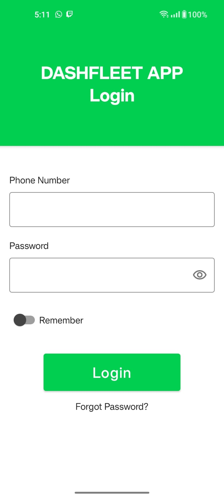

# dashfleet-technical-test

Dashfleet technical test Android app for Android App vacant.  

Login simulation app using Firesbase Firestore as API, implemented with:  

-Kotlin  
-Jetpack Compose  
-Clean arquitecture  
-MVVM  
-Live Data  
-Dependency Injection with Dagger Hilt  
-Unit testing with Junit  
-Mockk  

